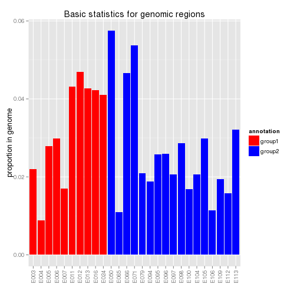
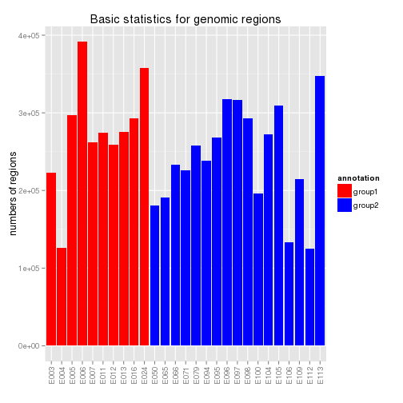
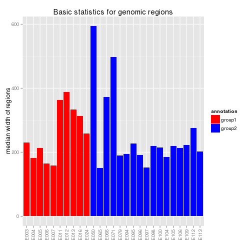
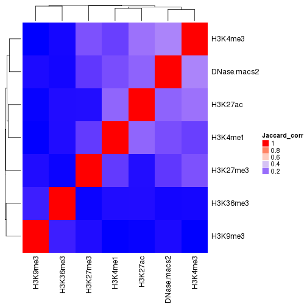
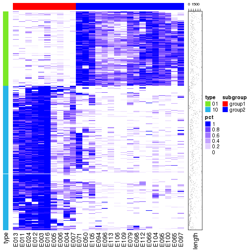

Utilities for analyzing genomic regions
=======================================


```
## Error in eval(expr, envir, enclos): could not find function "qq.options"
```

There are several functions in the **epik** package which provides convinient ways to
analyze genomic regions. This document demostrates the usage of these functions.

First we configure how to read data:


```r
source("~/project/development/epik/roadmap/data_config.R")
```

## Basic statistics

`basic_genomic_regions_stat()` simply makes barplots for some basic statistics for genomic regions.
There are following statistics:

- `proportion`: proportion in genome. If `by_chr = TRUE`, each bar represents the proportion in each chromosome.
- `number`: number of regions. If `by_chr = TRUE`, each bar represents the number of regions in each chromosome.
- `median_width`: meidan width of regions. If `by_chr = TRUE`, each bar represents the meidan width in each chromosome.

We use H3K4me1 peaks as an example:


```r
peak_list = get_peak_list("H3K4me1")
basic_genomic_regions_stat(peak_list, annotation = SUBGROUP, 
	annotation_color = SUBGROUP_COLOR, type = "proportion")
```



```r
basic_genomic_regions_stat(peak_list, annotation = SUBGROUP, 
	annotation_color = SUBGROUP_COLOR, type = "number")
```



```r
basic_genomic_regions_stat(peak_list, annotation = SUBGROUP, 
	annotation_color = SUBGROUP_COLOR, type = "median_width")
```



```r
basic_genomic_regions_stat(peak_list, annotation = SUBGROUP, 
	annotation_color = SUBGROUP_COLOR, by_chr = TRUE)
```


## Merge regions

`GenomicRanges::reduce` only merges regions with fixed gap width, but sometimes it is not reasonable to set gap
to a same width for all regions. Assuming we have a list of differentially methylated regions (DMRs) and we want to reduce
the number of DMRs by merging neighouring DMRs. DMRs distribute differently in different places in the genome, e.g. DMRs are dense
and short in CpG-rich regions (e.g. CpG islands) while long in CpG-sparse regions (e.g. gene bodies and intergenic regions),
thus the merging should be applied based to the width of every DMR itself. `reduce2` can merge regions by the width of every region itself.
This type of merging is dynamic because after each iteration of merging, some regions are merged into a large region and 
it will has longer extension. The whole merging will proceed iteratively unless there is no new merging.


```r
peak_list[[1]]
```

```
## GRanges object with 223151 ranges and 1 metadata column:
##            seqnames                 ranges strand   |   density
##               <Rle>              <IRanges>  <Rle>   | <integer>
##        [1]    chr22 [ 44541878,  44542490]      *   |       653
##        [2]    chr22 [ 39571114,  39572361]      *   |       548
##        [3]     chr1 [155166376, 155167688]      *   |       530
##        [4]     chr1 [230887664, 230888168]      *   |       506
##        [5]     chr6 [159273333, 159274447]      *   |       498
##        ...      ...                    ...    ... ...       ...
##   [223147]     chr8 [ 72472544,  72472704]      *   |        20
##   [223148]     chr9 [ 98368601,  98368762]      *   |        20
##   [223149]    chr20 [ 45958452,  45958604]      *   |        20
##   [223150]     chr2 [206565018, 206565277]      *   |        20
##   [223151]     chr8 [ 15363861,  15364004]      *   |        20
##   -------
##   seqinfo: 24 sequences from an unspecified genome; no seqlengths
```

```r
peak_reduced = reduce2(peak_list[[1]], gap = 0.5)
```

```
## Regions are extended by 0.5*width (maximum Inf bp).
## regions have been reduced from 223151 to 186113...
## regions have been reduced from 186113 to 177389...
## regions have been reduced from 177389 to 173966...
## regions have been reduced from 173966 to 172190...
## regions have been reduced from 172190 to 171010...
## regions have been reduced from 171010 to 170144...
## regions have been reduced from 170144 to 169376...
## regions have been reduced from 169376 to 168719...
## regions have been reduced from 168719 to 168039...
## regions have been reduced from 168039 to 167385...
## regions have been reduced from 167385 to 166664...
## regions have been reduced from 166664 to 165876...
## regions have been reduced from 165876 to 164977...
## regions have been reduced from 164977 to 163810...
## regions have been reduced from 163810 to 162275...
## regions have been reduced from 162275 to 160001...
## regions have been reduced from 160001 to 157049...
## regions have been reduced from 157049 to 153250...
## regions have been reduced from 153250 to 148399...
## regions have been reduced from 148399 to 140711...
## regions have been reduced from 140711 to 131339...
## regions have been reduced from 131339 to 121484...
## regions have been reduced from 121484 to 109444...
## regions have been reduced from 109444 to 95349...
## regions have been reduced from 95349 to 81670...
## regions have been reduced from 81670 to 70836...
## regions have been reduced from 70836 to 57519...
## regions have been reduced from 57519 to 48039...
## regions have been reduced from 48039 to 43413...
## regions have been reduced from 43413 to 37137...
## regions have been reduced from 37137 to 33644...
## regions have been reduced from 33644 to 29812...
## regions have been reduced from 29812 to 28066...
## regions have been reduced from 28066 to 26087...
## regions have been reduced from 26087 to 25343...
## regions have been reduced from 25343 to 25050...
## regions have been reduced from 25050 to 24723...
## regions have been reduced from 24723 to 23748...
## regions have been reduced from 23748 to 23162...
```

```r
peak_reduced
```

```
## GRanges object with 23162 ranges and 1 metadata column:
##           seqnames                ranges strand   |
##              <Rle>             <IRanges>  <Rle>   |
##       [1]    chr22 [17274366,  51195924]      *   |
##       [2]     chr1 [  779676, 249201817]      *   |
##       [3]     chr6 [  220911, 170908739]      *   |
##       [4]     chr8 [  386864, 146279013]      *   |
##       [5]     chr4 [  107857,    108254]      *   |
##       ...      ...                   ...    ... ...
##   [23158]     chrY  [21295860, 21296018]      *   |
##   [23159]     chrY  [21309139, 21309283]      *   |
##   [23160]     chrY  [21311150, 21311543]      *   |
##   [23161]     chrY  [21394183, 21394361]      *   |
##   [23162]     chrY  [21733680, 21733848]      *   |
##                            revmap
##                     <IntegerList>
##       [1] 218947,63088,100877,...
##       [2]  46953,16020,186156,...
##       [3]   15546,14490,86167,...
##       [4]  89778,75912,216146,...
##       [5]                   97396
##       ...                     ...
##   [23158]                   98457
##   [23159]                  130225
##   [23160]                  134367
##   [23161]                  164150
##   [23162]                  160281
##   -------
##   seqinfo: 24 sequences from an unspecified genome; no seqlengths
```

Use `bp()`, `mb()` to wrap a number to an absolute gap:


```r
peak_reduced = reduce2(peak_list[[1]], gap = bp(100))
```

```
## Regions are merged by an absolute distance: (<= 100 bp)
```

```r
peak_reduced
```

```
## GRanges object with 200557 ranges and 1 metadata column:
##            seqnames               ranges strand   |        revmap
##               <Rle>            <IRanges>  <Rle>   | <IntegerList>
##        [1]    chr22 [17274366, 17274757]      *   |        132765
##        [2]    chr22 [17274966, 17275109]      *   |        164363
##        [3]    chr22 [17275440, 17275752]      *   |        104437
##        [4]    chr22 [17288286, 17288429]      *   |        119266
##        [5]    chr22 [17290751, 17290959]      *   |        174464
##        ...      ...                  ...    ... ...           ...
##   [200553]     chrY [21295860, 21296018]      *   |         98457
##   [200554]     chrY [21309139, 21309283]      *   |        130225
##   [200555]     chrY [21311150, 21311543]      *   |        134367
##   [200556]     chrY [21394183, 21394361]      *   |        164150
##   [200557]     chrY [21733680, 21733848]      *   |        160281
##   -------
##   seqinfo: 24 sequences from an unspecified genome; no seqlengths
```

## Annotation

You can annotate to other genomic features by `annotate_to_genomic_features()`. You can choose to return
the percent of every region in `peak` which is covered by regions in `gf_list`, or just the number of regions
in `gf_list` that overlap to.


```r
peak = peak_list[[1]]
gf_list = list(gene = GENE, promoter = PROMOTER, cgi = CGI, cgi_shore = CGI_SHORE)
annotate_to_genomic_features(peak, gf_list)
```

```
## annotating to gene
## annotating to promoter
## annotating to cgi
## annotating to cgi_shore
```

```
## GRanges object with 223151 ranges and 5 metadata columns:
##            seqnames                 ranges strand   |   density
##               <Rle>              <IRanges>  <Rle>   | <integer>
##        [1]    chr22 [ 44541878,  44542490]      *   |       653
##        [2]    chr22 [ 39571114,  39572361]      *   |       548
##        [3]     chr1 [155166376, 155167688]      *   |       530
##        [4]     chr1 [230887664, 230888168]      *   |       506
##        [5]     chr6 [159273333, 159274447]      *   |       498
##        ...      ...                    ...    ... ...       ...
##   [223147]     chr8 [ 72472544,  72472704]      *   |        20
##   [223148]     chr9 [ 98368601,  98368762]      *   |        20
##   [223149]    chr20 [ 45958452,  45958604]      *   |        20
##   [223150]     chr2 [206565018, 206565277]      *   |        20
##   [223151]     chr8 [ 15363861,  15364004]      *   |        20
##            overlap_to_gene overlap_to_promoter overlap_to_cgi
##                  <numeric>           <numeric>      <numeric>
##        [1]               1                   0              0
##        [2]               0                   0              0
##        [3]               1                   0              0
##        [4]               1                   0              0
##        [5]               0                   0              0
##        ...             ...                 ...            ...
##   [223147]               1                   0              0
##   [223148]               0                   0              0
##   [223149]               1                   0              0
##   [223150]               1                   0              0
##   [223151]               1                   0              0
##            overlap_to_cgi_shore
##                       <numeric>
##        [1]                    0
##        [2]                    0
##        [3]                    0
##        [4]                    0
##        [5]                    0
##        ...                  ...
##   [223147]                    0
##   [223148]                    0
##   [223149]                    0
##   [223150]                    0
##   [223151]                    0
##   -------
##   seqinfo: 24 sequences from an unspecified genome; no seqlengths
```

```r
annotate_to_genomic_features(peak, gf_list, type = "number")
```

```
## annotating to gene
## annotating to promoter
## annotating to cgi
## annotating to cgi_shore
```

```
## GRanges object with 223151 ranges and 5 metadata columns:
##            seqnames                 ranges strand   |   density
##               <Rle>              <IRanges>  <Rle>   | <integer>
##        [1]    chr22 [ 44541878,  44542490]      *   |       653
##        [2]    chr22 [ 39571114,  39572361]      *   |       548
##        [3]     chr1 [155166376, 155167688]      *   |       530
##        [4]     chr1 [230887664, 230888168]      *   |       506
##        [5]     chr6 [159273333, 159274447]      *   |       498
##        ...      ...                    ...    ... ...       ...
##   [223147]     chr8 [ 72472544,  72472704]      *   |        20
##   [223148]     chr9 [ 98368601,  98368762]      *   |        20
##   [223149]    chr20 [ 45958452,  45958604]      *   |        20
##   [223150]     chr2 [206565018, 206565277]      *   |        20
##   [223151]     chr8 [ 15363861,  15364004]      *   |        20
##            overlap_to_gene overlap_to_promoter overlap_to_cgi
##                  <integer>           <integer>      <integer>
##        [1]               1                   0              0
##        [2]               0                   0              0
##        [3]               1                   0              0
##        [4]               1                   0              0
##        [5]               0                   0              0
##        ...             ...                 ...            ...
##   [223147]               1                   0              0
##   [223148]               0                   0              0
##   [223149]               1                   0              0
##   [223150]               1                   0              0
##   [223151]               1                   0              0
##            overlap_to_cgi_shore
##                       <integer>
##        [1]                    0
##        [2]                    0
##        [3]                    0
##        [4]                    0
##        [5]                    0
##        ...                  ...
##   [223147]                    0
##   [223148]                    0
##   [223149]                    0
##   [223150]                    0
##   [223151]                    0
##   -------
##   seqinfo: 24 sequences from an unspecified genome; no seqlengths
```

You can also annotate the genomic regions to gene models. There will be following columns attached to `peak`:

- `nearest_gene_tss` the nearest tss
- `dist_to_gene_tss` distance to the closest tss
- `nearest_gene` the closest gene model
- `dist_to_gene` distance to the closest gene model
- `overlap_to_exon` percent of the region which is covered by exons or number of exons overlapped to the region
- `overlap_to_intron` percent of the region which is covered by introns or number of introns overlapped to the region
- `overlap_to_promoter` percent of the region which is covered by promoters or number of promoters overlapped to the region
- `overlap_to_intergenic` percent of the region which is covered by intergenic regions or number of intergenic regions overlapped to the region
- `overlap_to_fiveUTR` percent of the region which is covered by 5'UTRs or number of 5'UTRs overlapped to the region
- `overlap_to_threeUTR` percent of the region which is covered by 3'UTRs or number of 3'UTRs overlapped to the region


```r
annotate_to_gene_models(peak, TXDB)
```

```
## extracting genes
## extracting intergenic regions
## extracting tss, promoter, exon, intron, 5'UTR and 3'UTR
## annotating to closest gene tss
## annotating to closest gene
## annotating to gene
## annotating to exon
## annotating to intron
## annotating to promoter
## annotating to intergenic
## annotating to fiveUTR
## annotating to threeUTR
```

```
## GRanges object with 223151 ranges and 12 metadata columns:
##            seqnames                 ranges strand   |   density
##               <Rle>              <IRanges>  <Rle>   | <integer>
##        [1]    chr22 [ 44541878,  44542490]      *   |       653
##        [2]    chr22 [ 39571114,  39572361]      *   |       548
##        [3]     chr1 [155166376, 155167688]      *   |       530
##        [4]     chr1 [230887664, 230888168]      *   |       506
##        [5]     chr6 [159273333, 159274447]      *   |       498
##        ...      ...                    ...    ... ...       ...
##   [223147]     chr8 [ 72472544,  72472704]      *   |        20
##   [223148]     chr9 [ 98368601,  98368762]      *   |        20
##   [223149]    chr20 [ 45958452,  45958604]      *   |        20
##   [223150]     chr2 [206565018, 206565277]      *   |        20
##   [223151]     chr8 [ 15363861,  15364004]      *   |        20
##              nearest_gene_tss dist_to_gene_tss       nearest_gene
##                   <character>        <integer>        <character>
##        [1] ENSG00000138964.10            26345  ENSG00000188677.9
##        [2]  ENSG00000100307.8            22434  ENSG00000100307.8
##        [3] ENSG00000185499.11             3668  ENSG00000169231.8
##        [4]  ENSG00000135773.8             4533  ENSG00000135773.8
##        [5]  ENSG00000203711.6            16506  ENSG00000203711.6
##        ...                ...              ...                ...
##   [223147]  ENSG00000253379.1            31555  ENSG00000253379.1
##   [223148]  ENSG00000185920.9            89261  ENSG00000185920.9
##   [223149] ENSG00000101040.14            26962 ENSG00000101040.14
##   [223150] ENSG00000118257.11            18455 ENSG00000118257.11
##   [223151] ENSG00000104723.15            89136 ENSG00000104723.15
##            dist_to_gene overlap_to_gene overlap_to_exon overlap_to_intron
##               <integer>       <numeric>       <numeric>         <numeric>
##        [1]            0               1       0.0000000         1.0000000
##        [2]        22434               0       0.0000000         0.0000000
##        [3]            0               1       0.4851485         0.8172125
##        [4]            0               1       0.0000000         1.0000000
##        [5]        16506               0       0.0000000         0.0000000
##        ...          ...             ...             ...               ...
##   [223147]            0               1               0                 1
##   [223148]        89261               0               0                 0
##   [223149]            0               1               0                 1
##   [223150]            0               1               0                 1
##   [223151]            0               1               0                 1
##            overlap_to_promoter overlap_to_intergenic overlap_to_fiveUTR
##                      <numeric>             <numeric>          <numeric>
##        [1]                   0                     0                  0
##        [2]                   0                     1                  0
##        [3]                   0                     0                  0
##        [4]                   0                     0                  0
##        [5]                   0                     1                  0
##        ...                 ...                   ...                ...
##   [223147]                   0                     0                  0
##   [223148]                   0                     1                  0
##   [223149]                   0                     0                  0
##   [223150]                   0                     0                  0
##   [223151]                   0                     0                  0
##            overlap_to_threeUTR
##                      <numeric>
##        [1]        0.0000000000
##        [2]        0.0000000000
##        [3]        0.0007616146
##        [4]        0.0000000000
##        [5]        0.0000000000
##        ...                 ...
##   [223147]                   0
##   [223148]                   0
##   [223149]                   0
##   [223150]                   0
##   [223151]                   0
##   -------
##   seqinfo: 24 sequences from an unspecified genome; no seqlengths
```

## Correlation

`genomic_regios_correlation()` calculates how two sets of genomic regions correlate.
There are following correlation methods provides:


```r
sid = SAMPLE_ID[1]
peak_list2 = lapply(MARKS, function(mk) chipseq_hooks$peak(mk, sid))
names(peak_list2) = MARKS
genomic_corr_jaccard(peak_list2[[1]], peak_list2[[2]])
```

```
## [1] 0.09444328
```

```r
genomic_corr_reldist(peak_list2[[1]], peak_list2[[2]])
```

```
## [1] 0.1929335
```

```r
genomic_corr_absdist(peak_list2[[1]], peak_list2[[2]])
```

```
## [1] 51755.52
```

```r
genomic_corr_intersect(peak_list2[[1]], peak_list2[[2]], method = "number")
```

```
## [1] 36838
```

```r
genomic_corr_intersect(peak_list2[[1]], peak_list2[[2]], method = "percent")
```

```
## [1] 0.1402659
```

```r
genomic_corr_intersect(peak_list2[[1]], peak_list2[[2]], method = "length")
```

```
## [1] 9577243
```


```r
res = genomic_regions_correlation(peak_list2, peak_list2, nperm = 3)
```

```
## set strand to * and merge potential overlapped regions in gr_list_1.
## set strand to * and merge potential overlapped regions in gr_list_2.
## subset regions in selected chromosomes.
## calculating correlation between H3K4me1 and H3K4me1
## calculating correlation between H3K4me1 and H3K4me3
## calculating correlation between H3K4me1 and H3K27ac
## calculating correlation between H3K4me1 and H3K27me3
## calculating correlation between H3K4me1 and H3K36me3
## calculating correlation between H3K4me1 and H3K9me3
## calculating correlation between H3K4me1 and DNase.macs2
## calculating correlation between random_H3K4me1 and H3K4me1, 1/3
## calculating correlation between random_H3K4me1 and H3K4me3, 1/3
## calculating correlation between random_H3K4me1 and H3K27ac, 1/3
## calculating correlation between random_H3K4me1 and H3K27me3, 1/3
## calculating correlation between random_H3K4me1 and H3K36me3, 1/3
## calculating correlation between random_H3K4me1 and H3K9me3, 1/3
## calculating correlation between random_H3K4me1 and DNase.macs2, 1/3
## calculating correlation between random_H3K4me1 and H3K4me1, 2/3
## calculating correlation between random_H3K4me1 and H3K4me3, 2/3
## calculating correlation between random_H3K4me1 and H3K27ac, 2/3
## calculating correlation between random_H3K4me1 and H3K27me3, 2/3
## calculating correlation between random_H3K4me1 and H3K36me3, 2/3
## calculating correlation between random_H3K4me1 and H3K9me3, 2/3
## calculating correlation between random_H3K4me1 and DNase.macs2, 2/3
## calculating correlation between random_H3K4me1 and H3K4me1, 3/3
## calculating correlation between random_H3K4me1 and H3K4me3, 3/3
## calculating correlation between random_H3K4me1 and H3K27ac, 3/3
## calculating correlation between random_H3K4me1 and H3K27me3, 3/3
## calculating correlation between random_H3K4me1 and H3K36me3, 3/3
## calculating correlation between random_H3K4me1 and H3K9me3, 3/3
## calculating correlation between random_H3K4me1 and DNase.macs2, 3/3
## calculating correlation between H3K4me3 and H3K4me1
## calculating correlation between H3K4me3 and H3K4me3
## calculating correlation between H3K4me3 and H3K27ac
## calculating correlation between H3K4me3 and H3K27me3
## calculating correlation between H3K4me3 and H3K36me3
## calculating correlation between H3K4me3 and H3K9me3
## calculating correlation between H3K4me3 and DNase.macs2
## calculating correlation between random_H3K4me3 and H3K4me1, 1/3
## calculating correlation between random_H3K4me3 and H3K4me3, 1/3
## calculating correlation between random_H3K4me3 and H3K27ac, 1/3
## calculating correlation between random_H3K4me3 and H3K27me3, 1/3
## calculating correlation between random_H3K4me3 and H3K36me3, 1/3
## calculating correlation between random_H3K4me3 and H3K9me3, 1/3
## calculating correlation between random_H3K4me3 and DNase.macs2, 1/3
## calculating correlation between random_H3K4me3 and H3K4me1, 2/3
## calculating correlation between random_H3K4me3 and H3K4me3, 2/3
## calculating correlation between random_H3K4me3 and H3K27ac, 2/3
## calculating correlation between random_H3K4me3 and H3K27me3, 2/3
## calculating correlation between random_H3K4me3 and H3K36me3, 2/3
## calculating correlation between random_H3K4me3 and H3K9me3, 2/3
## calculating correlation between random_H3K4me3 and DNase.macs2, 2/3
## calculating correlation between random_H3K4me3 and H3K4me1, 3/3
## calculating correlation between random_H3K4me3 and H3K4me3, 3/3
## calculating correlation between random_H3K4me3 and H3K27ac, 3/3
## calculating correlation between random_H3K4me3 and H3K27me3, 3/3
## calculating correlation between random_H3K4me3 and H3K36me3, 3/3
## calculating correlation between random_H3K4me3 and H3K9me3, 3/3
## calculating correlation between random_H3K4me3 and DNase.macs2, 3/3
## calculating correlation between H3K27ac and H3K4me1
## calculating correlation between H3K27ac and H3K4me3
## calculating correlation between H3K27ac and H3K27ac
## calculating correlation between H3K27ac and H3K27me3
## calculating correlation between H3K27ac and H3K36me3
## calculating correlation between H3K27ac and H3K9me3
## calculating correlation between H3K27ac and DNase.macs2
## calculating correlation between random_H3K27ac and H3K4me1, 1/3
## calculating correlation between random_H3K27ac and H3K4me3, 1/3
## calculating correlation between random_H3K27ac and H3K27ac, 1/3
## calculating correlation between random_H3K27ac and H3K27me3, 1/3
## calculating correlation between random_H3K27ac and H3K36me3, 1/3
## calculating correlation between random_H3K27ac and H3K9me3, 1/3
## calculating correlation between random_H3K27ac and DNase.macs2, 1/3
## calculating correlation between random_H3K27ac and H3K4me1, 2/3
## calculating correlation between random_H3K27ac and H3K4me3, 2/3
## calculating correlation between random_H3K27ac and H3K27ac, 2/3
## calculating correlation between random_H3K27ac and H3K27me3, 2/3
## calculating correlation between random_H3K27ac and H3K36me3, 2/3
## calculating correlation between random_H3K27ac and H3K9me3, 2/3
## calculating correlation between random_H3K27ac and DNase.macs2, 2/3
## calculating correlation between random_H3K27ac and H3K4me1, 3/3
## calculating correlation between random_H3K27ac and H3K4me3, 3/3
## calculating correlation between random_H3K27ac and H3K27ac, 3/3
## calculating correlation between random_H3K27ac and H3K27me3, 3/3
## calculating correlation between random_H3K27ac and H3K36me3, 3/3
## calculating correlation between random_H3K27ac and H3K9me3, 3/3
## calculating correlation between random_H3K27ac and DNase.macs2, 3/3
## calculating correlation between H3K27me3 and H3K4me1
## calculating correlation between H3K27me3 and H3K4me3
## calculating correlation between H3K27me3 and H3K27ac
## calculating correlation between H3K27me3 and H3K27me3
## calculating correlation between H3K27me3 and H3K36me3
## calculating correlation between H3K27me3 and H3K9me3
## calculating correlation between H3K27me3 and DNase.macs2
## calculating correlation between random_H3K27me3 and H3K4me1, 1/3
## calculating correlation between random_H3K27me3 and H3K4me3, 1/3
## calculating correlation between random_H3K27me3 and H3K27ac, 1/3
## calculating correlation between random_H3K27me3 and H3K27me3, 1/3
## calculating correlation between random_H3K27me3 and H3K36me3, 1/3
## calculating correlation between random_H3K27me3 and H3K9me3, 1/3
## calculating correlation between random_H3K27me3 and DNase.macs2, 1/3
## calculating correlation between random_H3K27me3 and H3K4me1, 2/3
## calculating correlation between random_H3K27me3 and H3K4me3, 2/3
## calculating correlation between random_H3K27me3 and H3K27ac, 2/3
## calculating correlation between random_H3K27me3 and H3K27me3, 2/3
## calculating correlation between random_H3K27me3 and H3K36me3, 2/3
## calculating correlation between random_H3K27me3 and H3K9me3, 2/3
## calculating correlation between random_H3K27me3 and DNase.macs2, 2/3
## calculating correlation between random_H3K27me3 and H3K4me1, 3/3
## calculating correlation between random_H3K27me3 and H3K4me3, 3/3
## calculating correlation between random_H3K27me3 and H3K27ac, 3/3
## calculating correlation between random_H3K27me3 and H3K27me3, 3/3
## calculating correlation between random_H3K27me3 and H3K36me3, 3/3
## calculating correlation between random_H3K27me3 and H3K9me3, 3/3
## calculating correlation between random_H3K27me3 and DNase.macs2, 3/3
## calculating correlation between H3K36me3 and H3K4me1
## calculating correlation between H3K36me3 and H3K4me3
## calculating correlation between H3K36me3 and H3K27ac
## calculating correlation between H3K36me3 and H3K27me3
## calculating correlation between H3K36me3 and H3K36me3
## calculating correlation between H3K36me3 and H3K9me3
## calculating correlation between H3K36me3 and DNase.macs2
## calculating correlation between random_H3K36me3 and H3K4me1, 1/3
## calculating correlation between random_H3K36me3 and H3K4me3, 1/3
## calculating correlation between random_H3K36me3 and H3K27ac, 1/3
## calculating correlation between random_H3K36me3 and H3K27me3, 1/3
## calculating correlation between random_H3K36me3 and H3K36me3, 1/3
## calculating correlation between random_H3K36me3 and H3K9me3, 1/3
## calculating correlation between random_H3K36me3 and DNase.macs2, 1/3
## calculating correlation between random_H3K36me3 and H3K4me1, 2/3
## calculating correlation between random_H3K36me3 and H3K4me3, 2/3
## calculating correlation between random_H3K36me3 and H3K27ac, 2/3
## calculating correlation between random_H3K36me3 and H3K27me3, 2/3
## calculating correlation between random_H3K36me3 and H3K36me3, 2/3
## calculating correlation between random_H3K36me3 and H3K9me3, 2/3
## calculating correlation between random_H3K36me3 and DNase.macs2, 2/3
## calculating correlation between random_H3K36me3 and H3K4me1, 3/3
## calculating correlation between random_H3K36me3 and H3K4me3, 3/3
## calculating correlation between random_H3K36me3 and H3K27ac, 3/3
## calculating correlation between random_H3K36me3 and H3K27me3, 3/3
## calculating correlation between random_H3K36me3 and H3K36me3, 3/3
## calculating correlation between random_H3K36me3 and H3K9me3, 3/3
## calculating correlation between random_H3K36me3 and DNase.macs2, 3/3
## calculating correlation between H3K9me3 and H3K4me1
## calculating correlation between H3K9me3 and H3K4me3
## calculating correlation between H3K9me3 and H3K27ac
## calculating correlation between H3K9me3 and H3K27me3
## calculating correlation between H3K9me3 and H3K36me3
## calculating correlation between H3K9me3 and H3K9me3
## calculating correlation between H3K9me3 and DNase.macs2
## calculating correlation between random_H3K9me3 and H3K4me1, 1/3
## calculating correlation between random_H3K9me3 and H3K4me3, 1/3
## calculating correlation between random_H3K9me3 and H3K27ac, 1/3
## calculating correlation between random_H3K9me3 and H3K27me3, 1/3
## calculating correlation between random_H3K9me3 and H3K36me3, 1/3
## calculating correlation between random_H3K9me3 and H3K9me3, 1/3
## calculating correlation between random_H3K9me3 and DNase.macs2, 1/3
## calculating correlation between random_H3K9me3 and H3K4me1, 2/3
## calculating correlation between random_H3K9me3 and H3K4me3, 2/3
## calculating correlation between random_H3K9me3 and H3K27ac, 2/3
## calculating correlation between random_H3K9me3 and H3K27me3, 2/3
## calculating correlation between random_H3K9me3 and H3K36me3, 2/3
## calculating correlation between random_H3K9me3 and H3K9me3, 2/3
## calculating correlation between random_H3K9me3 and DNase.macs2, 2/3
## calculating correlation between random_H3K9me3 and H3K4me1, 3/3
## calculating correlation between random_H3K9me3 and H3K4me3, 3/3
## calculating correlation between random_H3K9me3 and H3K27ac, 3/3
## calculating correlation between random_H3K9me3 and H3K27me3, 3/3
## calculating correlation between random_H3K9me3 and H3K36me3, 3/3
## calculating correlation between random_H3K9me3 and H3K9me3, 3/3
## calculating correlation between random_H3K9me3 and DNase.macs2, 3/3
## calculating correlation between DNase.macs2 and H3K4me1
## calculating correlation between DNase.macs2 and H3K4me3
## calculating correlation between DNase.macs2 and H3K27ac
## calculating correlation between DNase.macs2 and H3K27me3
## calculating correlation between DNase.macs2 and H3K36me3
## calculating correlation between DNase.macs2 and H3K9me3
## calculating correlation between DNase.macs2 and DNase.macs2
## calculating correlation between random_DNase.macs2 and H3K4me1, 1/3
## calculating correlation between random_DNase.macs2 and H3K4me3, 1/3
## calculating correlation between random_DNase.macs2 and H3K27ac, 1/3
## calculating correlation between random_DNase.macs2 and H3K27me3, 1/3
## calculating correlation between random_DNase.macs2 and H3K36me3, 1/3
## calculating correlation between random_DNase.macs2 and H3K9me3, 1/3
## calculating correlation between random_DNase.macs2 and DNase.macs2, 1/3
## calculating correlation between random_DNase.macs2 and H3K4me1, 2/3
## calculating correlation between random_DNase.macs2 and H3K4me3, 2/3
## calculating correlation between random_DNase.macs2 and H3K27ac, 2/3
## calculating correlation between random_DNase.macs2 and H3K27me3, 2/3
## calculating correlation between random_DNase.macs2 and H3K36me3, 2/3
## calculating correlation between random_DNase.macs2 and H3K9me3, 2/3
## calculating correlation between random_DNase.macs2 and DNase.macs2, 2/3
## calculating correlation between random_DNase.macs2 and H3K4me1, 3/3
## calculating correlation between random_DNase.macs2 and H3K4me3, 3/3
## calculating correlation between random_DNase.macs2 and H3K27ac, 3/3
## calculating correlation between random_DNase.macs2 and H3K27me3, 3/3
## calculating correlation between random_DNase.macs2 and H3K36me3, 3/3
## calculating correlation between random_DNase.macs2 and H3K9me3, 3/3
## calculating correlation between random_DNase.macs2 and DNase.macs2, 3/3
```

```r
Heatmap(res$stat, name = "Jaccard_corr")
```



## Subgroup specific regions


```r
peak_list = get_peak_list("H3K4me3")
gr = common_regions(peak_list)
```

```
## merging 2/27 samples
## merging 3/27 samples
## merging 4/27 samples
## merging 5/27 samples
## merging 6/27 samples
## merging 7/27 samples
## merging 8/27 samples
## merging 9/27 samples
## merging 10/27 samples
## merging 11/27 samples
## merging 12/27 samples
## merging 13/27 samples
## merging 14/27 samples
## merging 15/27 samples
## merging 16/27 samples
## merging 17/27 samples
## merging 18/27 samples
## merging 19/27 samples
## merging 20/27 samples
## merging 21/27 samples
## merging 22/27 samples
## merging 23/27 samples
## merging 24/27 samples
## merging 25/27 samples
## merging 26/27 samples
## merging 27/27 samples
## calculating cross-sample coverage
## Regions are merged by an absolute distance: (<= 1000 bp)
## there are 26879 common regions
## overlapping `gr_list` to common regions.
## annotating to E003
## annotating to E004
## annotating to E005
## annotating to E006
## annotating to E007
## annotating to E011
## annotating to E012
## annotating to E013
## annotating to E016
## annotating to E024
## annotating to E050
## annotating to E065
## annotating to E066
## annotating to E071
## annotating to E079
## annotating to E094
## annotating to E095
## annotating to E096
## annotating to E097
## annotating to E098
## annotating to E100
## annotating to E104
## annotating to E105
## annotating to E106
## annotating to E109
## annotating to E112
## annotating to E113
```

```r
res = subgroup_specific_genomic_regions(gr, subgroup = SUBGROUP, 
	present = 0.6, absent = 0.2, type = c("01", "10"))
```

```
## extracting subgroup: '01', 401 regions
## extracting subgroup: '10', 772 regions
```

```r
res
```

```
## Subgroups: group1, group2 with following specificity patterns:
## - 01: 401 regions
## - 10: 772 regions
## The digits mean, e.g. 01, absent in group1, present in group2
```

```r
heatmap_subgroup_specificity(res, 
	top_annotation = HeatmapAnnotation(subgroup = SUBGROUP, col = list(subgroup = SUBGROUP_COLOR)))
```

```
## cluster rows for sub-matrix 01 (401 rows).
## cluster rows for sub-matrix 10 (772 rows).
## cluster columns for samples in subgroup group1.
## cluster columns for samples in subgroup group2.
## generating heatmap, (nrow = 1173, ncol = 27)
```



