Utilities for analyzing methylation data
=======================================


First we configure how to read data:


```r
source("~/project/development/epik/roadmap/data_config.R")
```


```r
wgbs_qcplot(SAMPLE_ID[1])
```

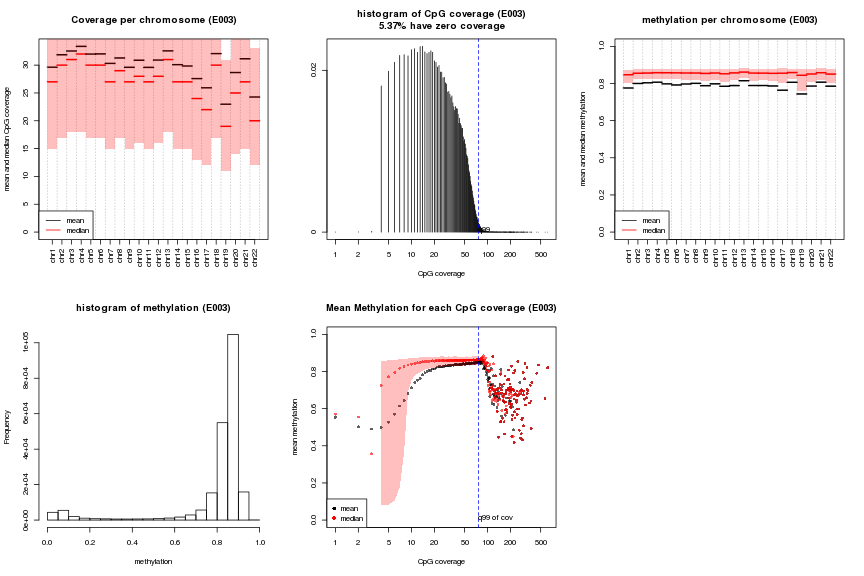

```r
wgbs_qcplot(SAMPLE_ID[1], background = CGI)
```

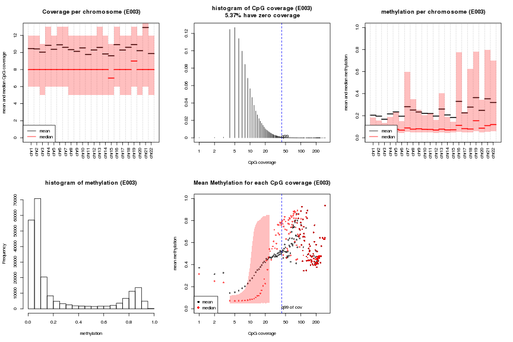

```r
wgbs_qcplot(SAMPLE_ID[1], background = CGI_SHORE)
```

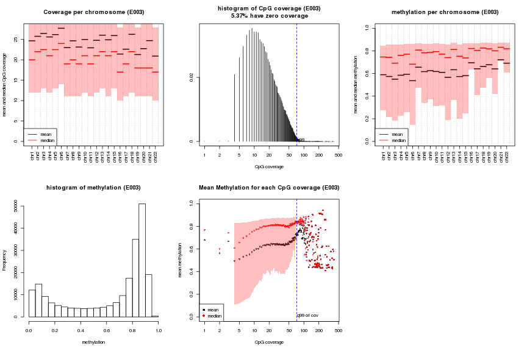


```r
gtrellis_coverage_and_methylation(SAMPLE_ID[1], nrow = 3, compact = TRUE)
```

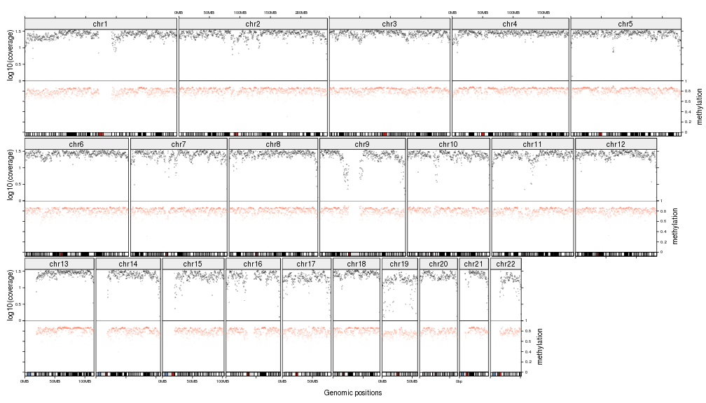


```r
gtrellis_methylation_for_multiple_samples(SAMPLE_ID, subgroup = SUBGROUP, nrow = 3, compact = TRUE)
```

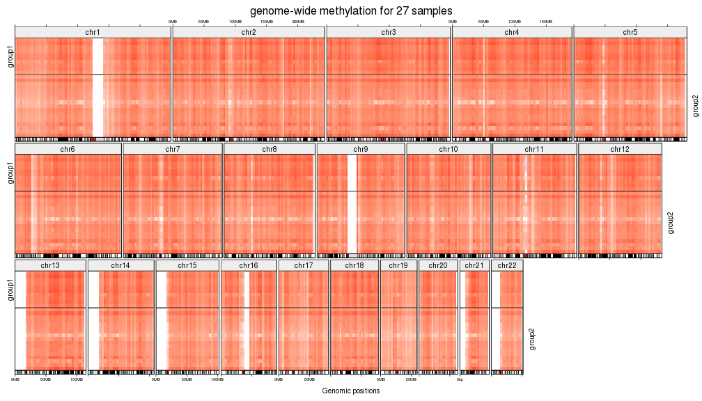


```r
ha = HeatmapAnnotation(subgroup = SUBGROUP, col = list(subgroup = SUBGROUP_COLOR))
global_methylation_distribution(SAMPLE_ID, subgroup = SUBGROUP, ha = ha)
```

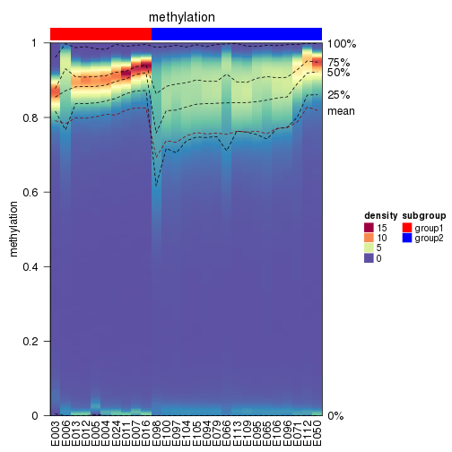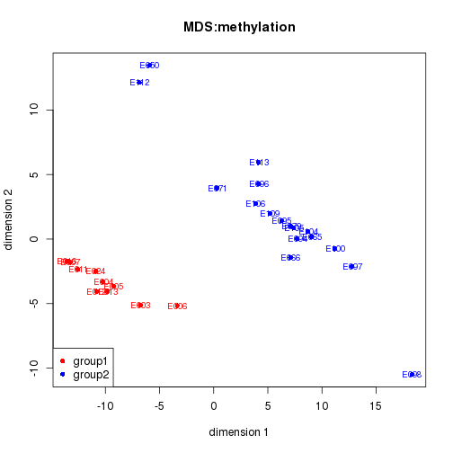

```r
global_methylation_distribution(SAMPLE_ID, subgroup = SUBGROUP, ha = ha, 
	background = CGI, meth_range = c(0, 0.1))
```

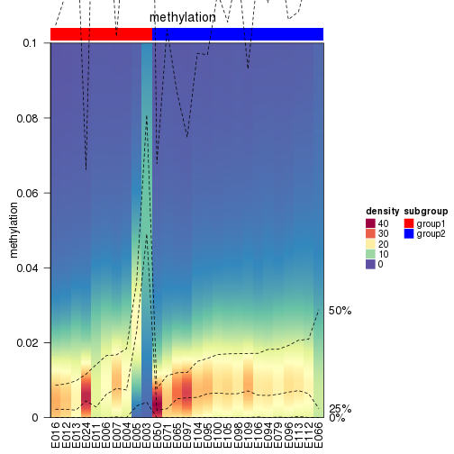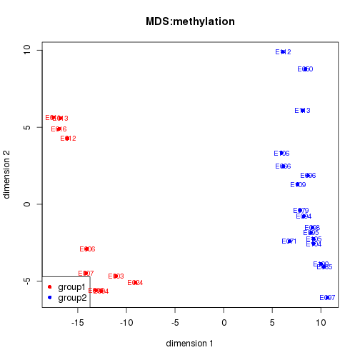

```r
global_methylation_distribution(SAMPLE_ID, subgroup = SUBGROUP, ha = ha, 
	background = CGI_SHORE)
```

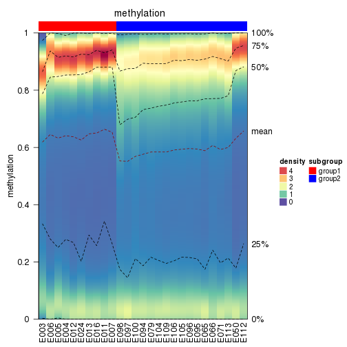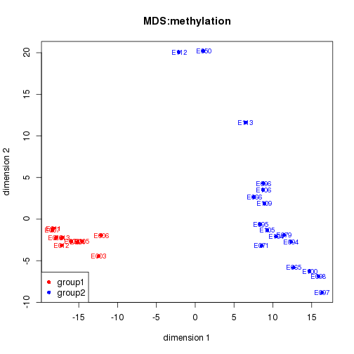


```r
sid = SAMPLE_ID[1]
peak_list = lapply(MARKS, function(mk) chipseq_hooks$peak(mk, sid))
names(peak_list) = MARKS
gf_list = list(gene = GENE, promoter = PROMOTER, cgi = CGI, cgi_shore = CGI_SHORE)
gr = get_mean_methylation_in_genomic_features(SAMPLE_ID, peak_list)
gr[[1]]
```

```
## GRanges object with 219213 ranges and 29 metadata columns:
##            seqnames                 ranges strand   |   density
##               <Rle>              <IRanges>  <Rle>   | <integer>
##        [1]    chr22 [ 44541878,  44542490]      *   |       653
##        [2]    chr22 [ 39571114,  39572361]      *   |       548
##        [3]     chr1 [155166376, 155167688]      *   |       530
##        [4]     chr1 [230887664, 230888168]      *   |       506
##        [5]     chr6 [159273333, 159274447]      *   |       498
##        ...      ...                    ...    ... ...       ...
##   [219209]     chr8 [ 72472544,  72472704]      *   |        20
##   [219210]     chr9 [ 98368601,  98368762]      *   |        20
##   [219211]    chr20 [ 45958452,  45958604]      *   |        20
##   [219212]     chr2 [206565018, 206565277]      *   |        20
##   [219213]     chr8 [ 15363861,  15364004]      *   |        20
##               mean_meth_E003    mean_meth_E004    mean_meth_E005
##                    <numeric>         <numeric>         <numeric>
##        [1] 0.678327397776947 0.768374731544659 0.813614585978675
##        [2] 0.642004441653827 0.466304736057292 0.642037635785944
##        [3] 0.687465792329605 0.795047642374085 0.808405770970291
##        [4] 0.648641316712147 0.667948552355026  0.63006202794989
##        [5] 0.469495318482923 0.520619052672456 0.507646385528832
##        ...               ...               ...               ...
##   [219209] 0.543376044476302 0.464700343546561 0.343171044964977
##   [219210] 0.851065010816565 0.856260643754346 0.855212919633698
##   [219211] 0.833959259272722  0.86738498265798 0.836674987323196
##   [219212] 0.794949327889509 0.683396335509711 0.781520790464618
##   [219213] 0.823599424258122 0.866504358611457 0.617803508954807
##               mean_meth_E006    mean_meth_E007    mean_meth_E011
##                    <numeric>         <numeric>         <numeric>
##        [1] 0.897356206504863  0.77050900098608 0.858539940262768
##        [2]  0.48514814203462 0.527302141966919 0.705860686245684
##        [3] 0.946834373486975 0.805500023983086 0.860468935822981
##        [4] 0.792487261330383 0.816859724458316 0.802944498359361
##        [5] 0.566438765418499 0.538928646572245 0.601808216676553
##        ...               ...               ...               ...
##   [219209] 0.188508164329179 0.543147160570006 0.576919428833443
##   [219210] 0.743082033183061 0.758916167675024 0.808669728977821
##   [219211] 0.931090532594003 0.938194127046569 0.912429006890506
##   [219212] 0.326129794076208 0.617658314311088 0.704419888922969
##   [219213] 0.481656433909777  0.91134057248711 0.900879604761245
##               mean_meth_E012    mean_meth_E013    mean_meth_E016
##                    <numeric>         <numeric>         <numeric>
##        [1] 0.807188308191915 0.851635457162888 0.845814744785663
##        [2] 0.613803171356066 0.589698594653729  0.61245917368562
##        [3] 0.742609434803649 0.838368264244621 0.820012758471572
##        [4] 0.714976056806296 0.745082104297958 0.651031868239853
##        [5]  0.56358434362669 0.625421735233832 0.593329963348781
##        ...               ...               ...               ...
##   [219209] 0.541405843198129 0.588284601080526 0.544664183175467
##   [219210] 0.787805519270931 0.815659462894977 0.811698693169422
##   [219211]  0.88090255087697 0.911823061578805 0.859525346896058
##   [219212] 0.632547728880032 0.520336960513917 0.631170849353283
##   [219213] 0.889108412976502 0.869604636609797 0.899008050059701
##               mean_meth_E024    mean_meth_E050    mean_meth_E065
##                    <numeric>         <numeric>         <numeric>
##        [1] 0.598294386326607 0.946768913200382 0.808755240336768
##        [2] 0.395852519899049   0.8652388766178 0.619659840524125
##        [3] 0.727787608242808 0.959054695928142 0.924451306905828
##        [4]  0.53417498249488 0.917609483426237 0.826359327133547
##        [5] 0.527462420889867 0.841748550136038 0.803371287946653
##        ...               ...               ...               ...
##   [219209] 0.455589710006331 0.208262009002805 0.372960800904624
##   [219210] 0.766641873576633 0.881122646247654 0.889302898808029
##   [219211] 0.874420907508561 0.844956348248562 0.680205790605171
##   [219212] 0.718870156462692 0.876704123119843   0.8261895558163
##   [219213] 0.900018202392879   0.8632476104796 0.651670929642749
##               mean_meth_E066    mean_meth_E071    mean_meth_E079
##                    <numeric>         <numeric>         <numeric>
##        [1] 0.875979549615991 0.881157429952966 0.868194897828454
##        [2] 0.666867740541451  0.67089592014979  0.59611891914408
##        [3] 0.968415552144168 0.684343338256385  0.86437101005218
##        [4]  0.82644347135496 0.481115389752685 0.714753063426582
##        [5] 0.861970811576325  0.85984725004407 0.570710781653531
##        ...               ...               ...               ...
##   [219209]  0.14482542316808  0.48647620366824 0.484376416356711
##   [219210] 0.860797918985389 0.701342645431002 0.519420565689716
##   [219211] 0.678441444299297 0.432961871672417 0.549630106661568
##   [219212] 0.761422718898826 0.774193426051683 0.745432691152906
##   [219213] 0.671617770917246 0.836175496219879 0.698876571288789
##               mean_meth_E094    mean_meth_E095    mean_meth_E096
##                    <numeric>         <numeric>         <numeric>
##        [1] 0.865823319169975 0.876407024321834 0.938996808677478
##        [2] 0.531518055094078 0.537132590697208 0.644758688313434
##        [3] 0.899585813692314 0.947375584463409 0.938848884215712
##        [4] 0.376805795580235 0.770662563909972 0.652009521576927
##        [5] 0.598083951169677 0.825336239707276 0.699081071014285
##        ...               ...               ...               ...
##   [219209] 0.189358855593133 0.271483448136494 0.266367057050787
##   [219210] 0.796215806515018   0.8511312726829 0.868459654210702
##   [219211] 0.573585059140986 0.635655370294896 0.855485894946613
##   [219212] 0.802809620687787  0.83317973134255 0.755329435877833
##   [219213] 0.825996189569601 0.814030620305873 0.769275701669059
##               mean_meth_E097     mean_meth_E098    mean_meth_E100
##                    <numeric>          <numeric>         <numeric>
##        [1] 0.911410510406889  0.837131341856325 0.853461484313246
##        [2] 0.435063105675089  0.663702041988848 0.440742307361383
##        [3] 0.726376282096577  0.546210071486167 0.700106628348677
##        [4]  0.80286783534884   0.76959231829968 0.523785268819587
##        [5] 0.707873015626349  0.658993920238425 0.819182949909153
##        ...               ...                ...               ...
##   [219209] 0.308841075294454 0.0699190410356078 0.632879610882309
##   [219210] 0.400759860940654  0.825301922955725 0.560032930043811
##   [219211] 0.650439317597432   0.69987699964405   0.3872045190785
##   [219212] 0.429470536745013  0.766543562901503 0.860882105979822
##   [219213] 0.823347806057985  0.614311741365122 0.716868817243452
##               mean_meth_E104    mean_meth_E105    mean_meth_E106
##                    <numeric>         <numeric>         <numeric>
##        [1]  0.87735173153842 0.902189374045816  0.86572963572758
##        [2] 0.509240929262874 0.550596110604433 0.620506729294707
##        [3] 0.888300471967395  0.92351285518564 0.928509989937249
##        [4] 0.695919508003414 0.826354894619352 0.429065707319112
##        [5] 0.799084766279225 0.834292846378582  0.62762955382948
##        ...               ...               ...               ...
##   [219209] 0.387564243038972 0.308637185890017 0.279168597576779
##   [219210] 0.788889667976727 0.842314167074757 0.772756352724969
##   [219211] 0.674645280599878 0.654835221360005 0.678440156786161
##   [219212] 0.758521571967748 0.838639542135232 0.783896400616253
##   [219213] 0.798296487752864 0.793838721209766 0.722233050049229
##               mean_meth_E109    mean_meth_E112    mean_meth_E113      ncpg
##                    <numeric>         <numeric>         <numeric> <numeric>
##        [1] 0.876735771659013 0.919364132285143 0.897134173363887        31
##        [2] 0.602928068411557 0.908509813973426 0.757179648686062        32
##        [3] 0.904732354303797 0.970494978556166 0.890470507644057        26
##        [4]  0.64926355655035 0.910433707106174 0.813266738444839        12
##        [5] 0.643729752078393 0.832242034319166 0.771703230448022        16
##        ...               ...               ...               ...       ...
##   [219209]   0.2279799967781 0.338036181933354 0.288943078069369         1
##   [219210] 0.760345236479524 0.909620784060484 0.818900413397792         3
##   [219211] 0.722959324548653  0.94901256470702 0.868960099938944         2
##   [219212] 0.643412787981226 0.855846554722549 0.628650552805237         4
##   [219213] 0.732629853275564 0.841879009757661 0.742163220357924         1
##   -------
##   seqinfo: 24 sequences from an unspecified genome; no seqlengths
```

```r
heatmap_diff_methylation_in_genomic_features(gr[[1]], subgroup = SUBGROUP, ha = ha,
	min_mean_range = 0.2, cutoff = 0.01, genomic_features = gf_list)
```


