Visualize global difference by Hilbert curve
=============================================


First we configure how to read data:


```r
source("~/project/development/epik/roadmap/data_config.R")
```


```r
gr_meth = hilbert_curve_methylation_difference(subgroup = SUBGROUP,
	comparison = c("group1", "group2"), type = c("global_mean", "subgroup_mean", "difference"))
```

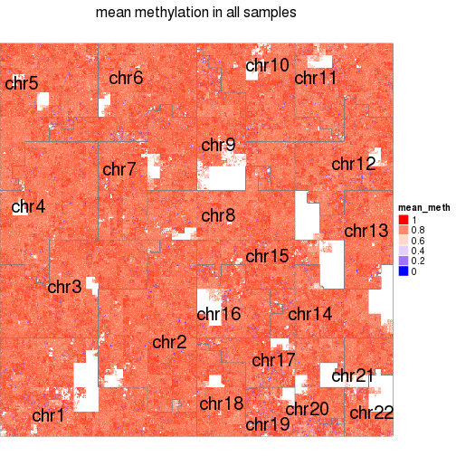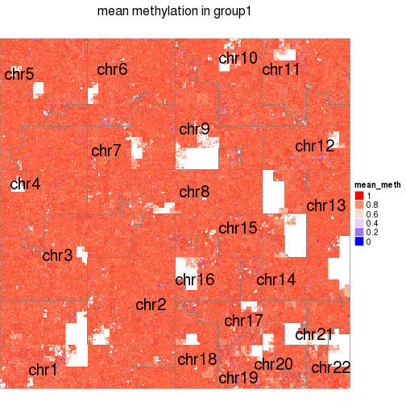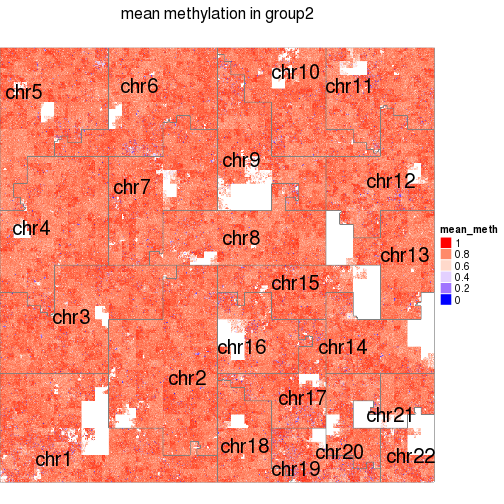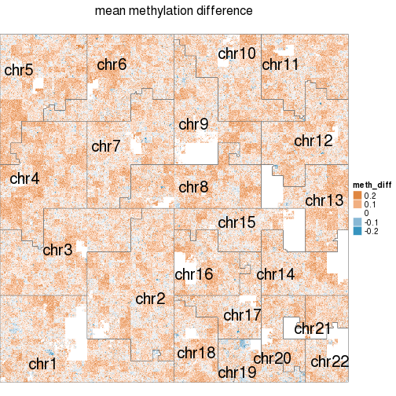

```r
gr_meth
```

```
## GRanges object with 2881044 ranges and 3 metadata columns:
##             seqnames               ranges strand   | mean_group1
##                <Rle>            <IRanges>  <Rle>   |   <numeric>
##         [1]     chr1         [   1, 1000]      *   |         NaN
##         [2]     chr1         [1001, 2000]      *   |         NaN
##         [3]     chr1         [2001, 3000]      *   |         NaN
##         [4]     chr1         [3001, 4000]      *   |         NaN
##         [5]     chr1         [4001, 5000]      *   |         NaN
##         ...      ...                  ...    ... ...         ...
##   [2881040]    chr22 [51300001, 51301000]      *   |         NaN
##   [2881041]    chr22 [51301001, 51302000]      *   |         NaN
##   [2881042]    chr22 [51302001, 51303000]      *   |         NaN
##   [2881043]    chr22 [51303001, 51304000]      *   |         NaN
##   [2881044]    chr22 [51304001, 51304566]      *   |         NaN
##             mean_group2      mean
##               <numeric> <numeric>
##         [1]         NaN       NaN
##         [2]         NaN       NaN
##         [3]         NaN       NaN
##         [4]         NaN       NaN
##         [5]         NaN       NaN
##         ...         ...       ...
##   [2881040]         NaN       NaN
##   [2881041]         NaN       NaN
##   [2881042]         NaN       NaN
##   [2881043]         NaN       NaN
##   [2881044]         NaN       NaN
##   -------
##   seqinfo: 22 sequences from an unspecified genome; no seqlengths
```


```r
gr_list = lapply(MARKS, function(mk) hilbert_curve_chipseq_difference(mk, subgroup = SUBGROUP, 
	comparison = c("group1", "group2"), type = "rel_difference"))
```

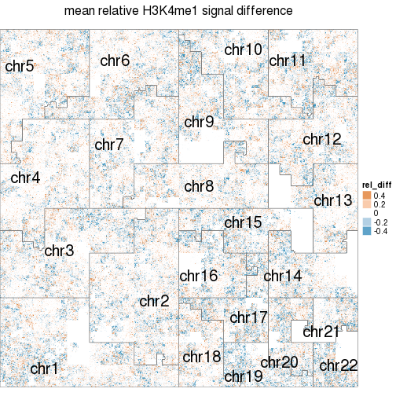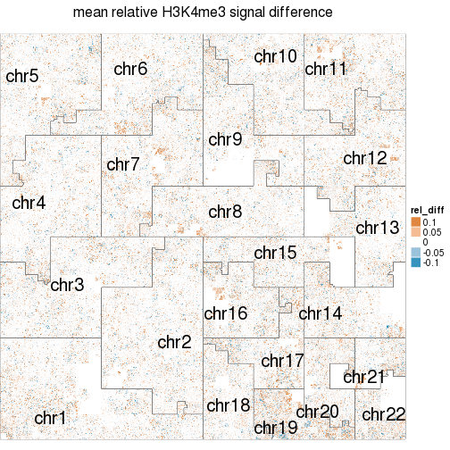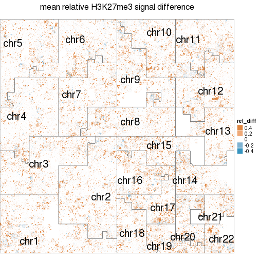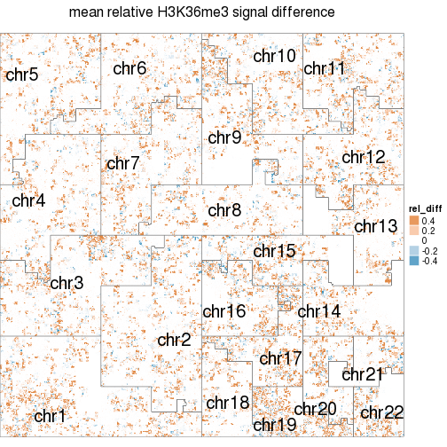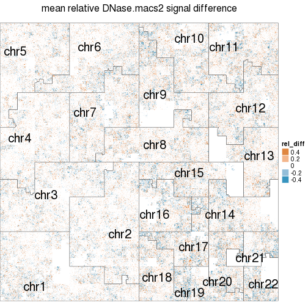

```r
gr_list[[1]]
```

```
## GRanges object with 2881044 ranges and 3 metadata columns:
##             seqnames               ranges strand   | mean_group1
##                <Rle>            <IRanges>  <Rle>   |   <numeric>
##         [1]     chr1         [   1, 1000]      *   |           0
##         [2]     chr1         [1001, 2000]      *   |           0
##         [3]     chr1         [2001, 3000]      *   |           0
##         [4]     chr1         [3001, 4000]      *   |           0
##         [5]     chr1         [4001, 5000]      *   |           0
##         ...      ...                  ...    ... ...         ...
##   [2881040]    chr22 [51300001, 51301000]      *   |           0
##   [2881041]    chr22 [51301001, 51302000]      *   |           0
##   [2881042]    chr22 [51302001, 51303000]      *   |           0
##   [2881043]    chr22 [51303001, 51304000]      *   |           0
##   [2881044]    chr22 [51304001, 51304566]      *   |           0
##             mean_group2      mean
##               <numeric> <numeric>
##         [1]           0         0
##         [2]           0         0
##         [3]           0         0
##         [4]           0         0
##         [5]           0         0
##         ...         ...       ...
##   [2881040]           0         0
##   [2881041]           0         0
##   [2881042]           0         0
##   [2881043]           0         0
##   [2881044]           0         0
##   -------
##   seqinfo: 22 sequences from an unspecified genome; no seqlengths
```


```r
names(gr_list) = MARKS
gr_meth$diff = gr_meth$mean_group1 - gr_meth$mean_group2
gr_list = lapply(gr_list, function(gr) {
	gr$diff = gr$mean_group1 - gr$mean_group2
	gr
})
general_chipseq_association_to_methylation(gr_list, gr_meth)
```

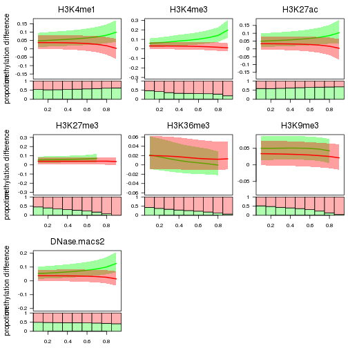

```r
general_chipseq_association(gr_list)
```

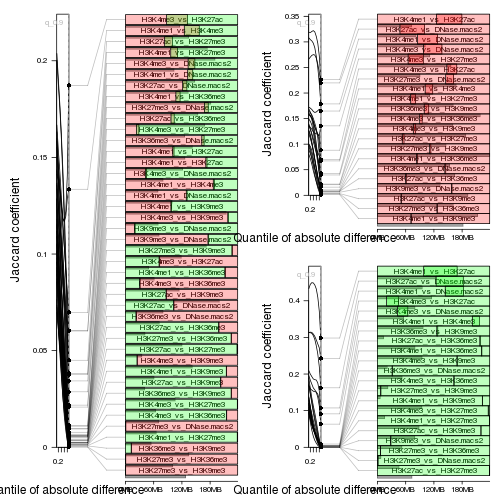

```r
general_chipseq_association(gr_list, q = seq(0.1, 0.9, by = 0.1))
```

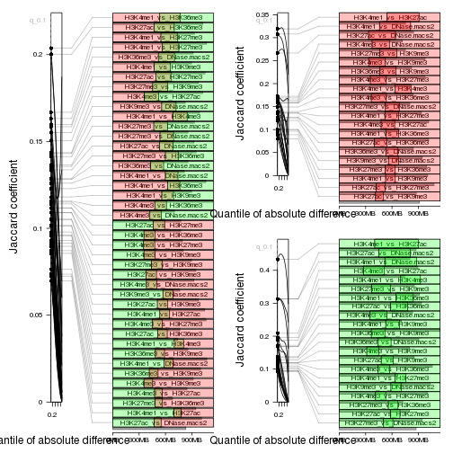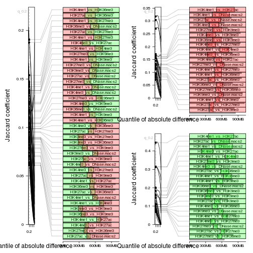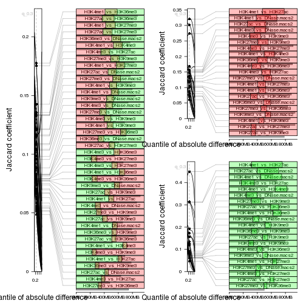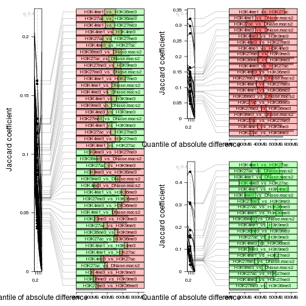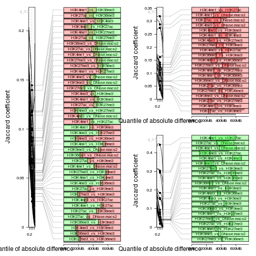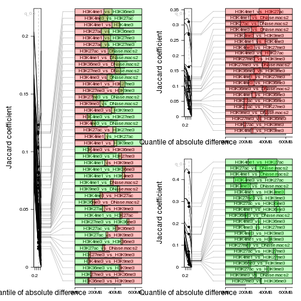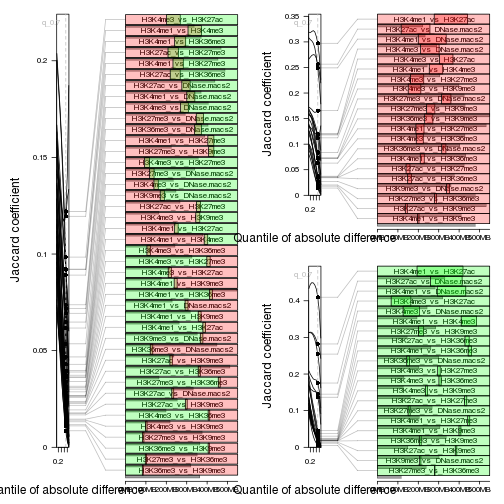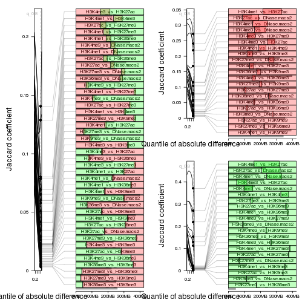
